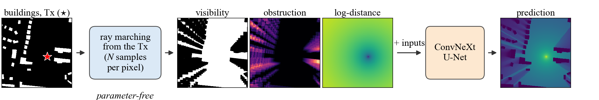
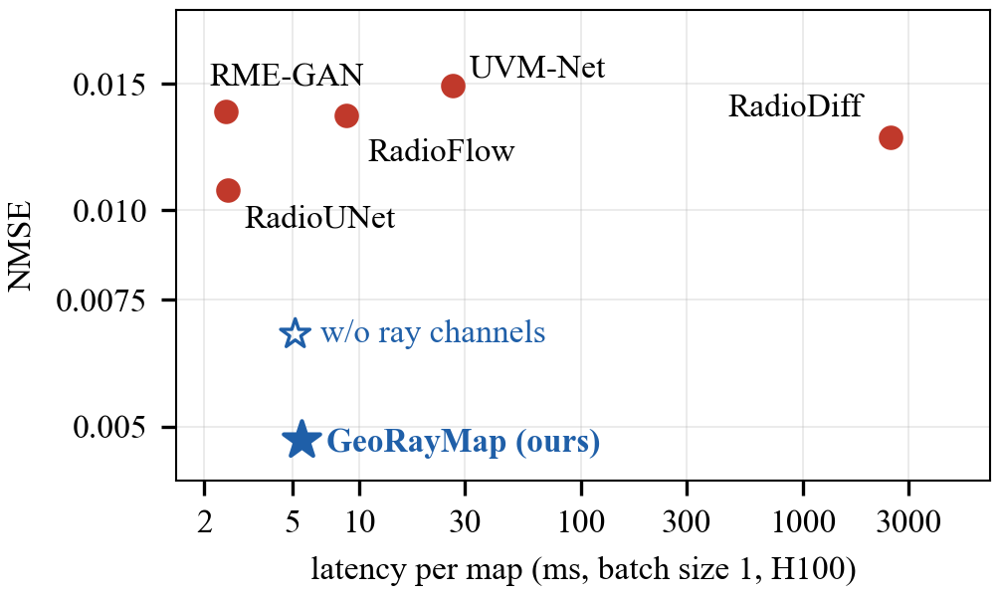
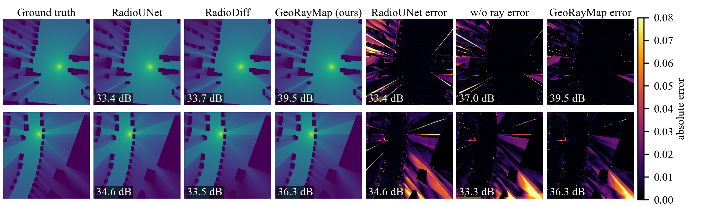

# GeoRayMap

**GeoRayMap: Geometry-aware radio map estimation with ray-derived features**<br>
Paria Mohammadzadeh Hesar and Hina Tabassum, York University. Submitted to IEEE ICASSP 2027.

GeoRayMap predicts a radio map, the pathloss from a transmitter to every point of a city map, in a
single forward pass. A parameter-free ray-marching layer samples the building map along the
straight segment from the transmitter to every pixel (all pixels at once, with batched
`grid_sample` calls) and returns four channels: soft direct-path visibility, obstructed path
length, distance and log-distance. The obstructed length measures how much of the direct path
lies inside buildings, not only whether it is blocked. A ConvNeXt U-Net with 10.9 M parameters
maps these four channels, together with the building and transmitter maps (six input channels),
to the radio map.



## Results on RadioMapSeer

All models were trained and evaluated by us under one protocol: the 7,920 test maps of
RadioMapSeer (DPM simulations, thresholded targets), metrics averaged over maps, and latency at
batch size 1 on one NVIDIA H100. See [results/](results/) for every number and its run.

| Method | NMSE (10⁻³) ↓ | RMSE (10⁻²) ↓ | PSNR (dB) ↑ | SSIM ↑ | ms per map ↓ | Params (M) |
|---|---:|---:|---:|---:|---:|---:|
| RME-GAN | 13.73 | 2.228 | 33.29 | 0.9123 | **2.51** | 13.3 |
| RadioUNet | 10.68 | 1.961 | 34.45 | 0.9240 | 2.56 | 13.3 |
| UVM-Net | 14.92 | 2.381 | 32.62 | 0.8995 | 26.4 | 1004 |
| RadioDiff† | 12.65 | 2.126 | 33.69 | 0.9231 | 2497 | 280 |
| RadioFlow† | 13.55 | 2.301 | 32.94 | 0.8452 | 8.76 | 54.1 |
| **GeoRayMap** | **4.79** | **1.288** | **38.12** | **0.9564** | 5.48 | **10.9** |

† Our reproductions, which are weaker than the published results (see the paper).



For the same network, the ray channels lower the NMSE by 29% and raise the PSNR by 1.6 dB; the
rest of GeoRayMap's 3.7 dB gain over RadioUNet (2.1 dB) comes from the backbone and loss. The
channels give a similar gain with another backbone (RadioUNet and its own recipe) and with
ray-traced (IRT2) targets, so it comes from the geometry, not from our backbone or the DPM
simulator (NMSE in 10⁻³):

| Setting | w/o ray channels | with ray channels (N = 16) |
|---|---|---|
| ConvNeXt U-Net, DPM targets | 36.51 dB, NMSE 6.72 | **38.12 dB, NMSE 4.79** |
| RadioUNet and its MSE recipe, DPM targets | 34.45 dB, NMSE 10.68 | **35.77 dB, NMSE 8.03** |
| ConvNeXt U-Net, IRT2 targets | 32.17 dB, NMSE 21.10 | **33.74 dB, NMSE 15.40** |

N = 64 samples per ray gives the same accuracy as N = 16 (38.11 dB), and a learned attenuation
channel does not help (37.93 dB).



## Installation

```bash
git clone https://github.com/pariamdz1992/GeoRayMap.git
cd GeoRayMap
pip install -r requirements.txt
```

Training needs a CUDA GPU (an 80 GB H100 fits the default batch of 32); evaluation also runs on
the CPU, slowly.

## Data

Download RadioMapSeer from the [dataset page](https://radiomapseer.github.io/) (CC BY 4.0). The
code expects its original layout:

```
RadioMapSeer/
├── png/buildings_complete/<map>.png   # city maps, 256 x 256
├── png/antennas/<map>_<tx>.png        # one transmitter per image, 80 per map
├── gain/DPM/<map>_<tx>.png            # targets (dominant path model)
└── gain/IRT2/<map>_<tx>.png           # targets for the IRT2 experiments
```

The split is RadioUNet's: the maps are shuffled with seed 42, positions 0–500 are used for
training, 501–600 for validation and 601–699 for testing.

## Pretrained models

The weights of every GeoRayMap row in the paper are attached to the
[v1.0 release](https://github.com/pariamdz1992/GeoRayMap/releases/tag/v1.0):

| File | Model | PSNR (dB) |
|---|---|---:|
| `georaymap_srm_n16.pt` | **GeoRayMap** (Tables 1 and 2) | 38.12 |
| `georaymap_srm_noray.pt` | the same network without ray channels | 36.51 |
| `georaymap_srm_n64.pt` | N = 64 samples per ray | 38.11 |
| `georaymap_srm_n64_nossim.pt` | N = 64, trained without the SSIM term | 38.01 |
| `georaymap_srm_n64_learned.pt` | N = 64 + learned attenuation channel | 37.93 |
| `georaymap_irt2_n16.pt` | trained and tested on IRT2 targets | 33.74 |
| `georaymap_irt2_noray.pt` | IRT2 targets, without ray channels | 32.17 |
| `radiounet_ray_n16.pt` | RadioUNet + ray channels ([radiounet_ray/](radiounet_ray/)) | 35.77 |

```bash
wget https://github.com/pariamdz1992/GeoRayMap/releases/download/v1.0/georaymap_srm_n16.pt
python evaluate.py --ckpt georaymap_srm_n16.pt --data_dir /path/to/RadioMapSeer/
```

`evaluate.py` scores the 7,920 test maps at batch size 1 and prints NMSE, RMSE, PSNR, SSIM and
latency. `--save_preds DIR` also writes every prediction as `<map>_<tx>.png`.

## Training

```bash
python train.py --data_dir /path/to/RadioMapSeer/                   # GeoRayMap, about 10 h on one H100
python train.py --data_dir /path/to/RadioMapSeer/ --n_samples 0     # without ray channels
python train.py --data_dir /path/to/RadioMapSeer/ --smoke           # a quick check, CPU is fine
```

Each run saves `checkpoints/<run>/best_ema.pt` with a `config.json` and ends with its test-set
evaluation. [scripts/reproduce_paper.sh](scripts/reproduce_paper.sh) lists the command behind
every row of the paper, and [scripts/slurm_job.sh](scripts/slurm_job.sh) submits them to SLURM.

## Using the ray layer in your own network

The layer needs only PyTorch:

```python
import torch
from georaymap import RayFeatures, load_checkpoint

x = torch.zeros(1, 2, 256, 256)       # [buildings, transmitter], values in [0, 1]
x[0, 0, 100:140, 60:90] = 1.0         # a building
x[0, 1, 128, 20] = 1.0                # the transmitter (one-hot)

rays = RayFeatures(n_samples=16)(x)   # [1, 4, 256, 256]: visibility, obstructed length,
                                      # log-distance, distance
model, config = load_checkpoint("georaymap_srm_n16.pt")
with torch.no_grad():
    radio_map = model(x)              # [1, 1, 256, 256], values in [0, 1]
```

## Repository layout

| Path | Contents |
|---|---|
| `georaymap/rays.py` | the ray-marching layer |
| `georaymap/model.py`, `georaymap/unet.py` | GeoRayMap and its ConvNeXt U-Net |
| `georaymap/losses.py`, `georaymap/metrics.py` | training loss and evaluation metrics |
| `georaymap/data.py` | RadioMapSeer loader with RadioUNet's split |
| `train.py`, `evaluate.py`, `export_checkpoint.py` | training, evaluation, packaging of weights |
| `radiounet_ray/` | RadioUNet with and without the ray channels |
| `figures/` | scripts for Figs. 2 and 3 of the paper |
| `results/` | every number of Tables 1 and 2 |

## Notes on the evaluation

- Targets are RadioMapSeer gains after RadioUNet's threshold transform: gains below 0.2 are
  clipped, then rescaled to [0, 1]. Scores computed on raw gains (as in the RadioDiff paper) are
  in a different range, about 2 dB lower in PSNR, so compare numbers only on the same targets.
- NMSE and PSNR depend on how they are averaged. We average over maps (batch size 1); larger
  evaluation batches give different values, while SSIM does not change.
- Latency is the wall-clock time per map at batch size 1 after warm-up, in fp32 on one H100.
- The layer takes N samples per ray, so on long rays it can miss walls thinner than the sample
  spacing. N = 16 and N = 64 perform the same on RadioMapSeer.

## Citation

```bibtex
@misc{hesar2026georaymap,
  author = {Mohammadzadeh Hesar, Paria and Tabassum, Hina},
  title  = {{GeoRayMap}: Geometry-aware radio map estimation with ray-derived features},
  note   = {Submitted to IEEE ICASSP 2027},
  year   = {2026}
}
```

Please also cite the RadioMapSeer dataset:

```bibtex
@misc{yapar2022radiomapseer,
  author       = {Yapar, {\c{C}}a{\u{g}}kan and Levie, Ron and Kutyniok, Gitta and Caire, Giuseppe},
  title        = {Dataset of Pathloss and {ToA} Radio Maps With Localization Application},
  howpublished = {arXiv:2212.11777},
  year         = {2022}
}
```

## License and acknowledgments

MIT, see [LICENSE](LICENSE). `georaymap/data.py` is adapted from, and `radiounet_ray/lib/loaders.py`
and `radiounet_ray/lib/modules.py` are copied from, [RadioUNet](https://github.com/RonLevie/RadioUNet)
(MIT, Copyright (c) 2019 Ron Levie; see `radiounet_ray/LICENSE-RadioUNet`).

This research was enabled in part by support provided by Calcul Québec (calculquebec.ca) and the
Digital Research Alliance of Canada (alliancecan.ca).

Questions and bug reports: please open an issue, or contact Paria Mohammadzadeh Hesar
(pariamdz@yorku.ca).
